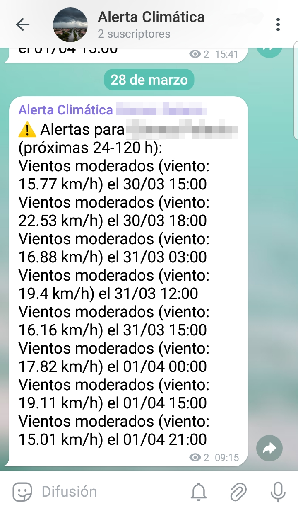

# 🌦️ Bot de alertas climáticas en Python ⚡

Un script en Python que monitorea condiciones climáticas extremas y envía alertas predictivas a Telegram. Ideal para prevenir riesgos meteorológicos con 24-120 horas de anticipación.

## ✨ Características

- 🔔 Alertas para:
  - Temperaturas extremas (altas/bajas)
  - Lluvias intensas
  - 📊 Usa datos de pronóstico de OpenWeatherMap
  - 🔒 Configuración segura con variables de entorno
  - 🐍 Desarrollado en Python con Poetry para gestión de dependencias

### Requisitos

- Python 3.8+
- Cuenta en [OpenWeatherMap](https://openweathermap.org/)
- Bot de Telegram ([@BotFather](https://t.me/BotFather))
